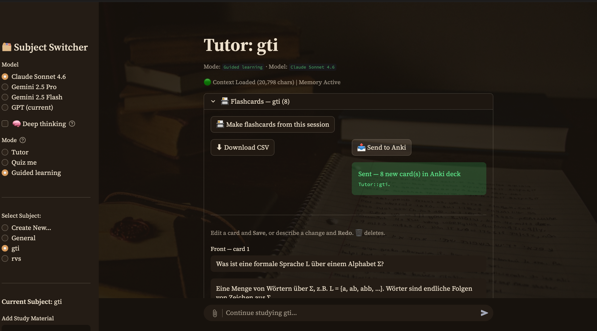

#  AI Study Tutor

A multi-provider, multi-mode study assistant built with Streamlit. Load your course PDFs (or
snap a photo of your notes), then learn through Socratic dialogue, get quizzed, or follow a
guided **Introduction → Deep dive → Quiz** journey — and turn what you studied into Anki
flashcards in one click.

It runs against **Claude, Gemini, or GPT** behind a single swappable interface, with streaming
responses and prompt caching to keep a long study session fast and cheap.

## Screenshots

| Guided learning | Flashcards → Anki |
|---|---|
|  |  |

## Features

- **Multi-provider, swappable models** — pick Claude Sonnet 4.6 / Gemini 2.5 Pro / Gemini 2.5
  Flash / GPT from a dropdown; the model that answered each message is recorded.
- **Streaming responses** — replies render token-by-token via `st.write_stream`.
- **Prompt caching** — the system prompt + PDF knowledge base (re-sent every turn) is cached on
  Claude (`cache_control: ephemeral`), so a 20–30-turn session reuses the stable prefix instead
  of reprocessing ~15k tokens each time.
- **Study modes**
  - **Tutor** — strict Socratic questioning (Feynman technique).
  - **Quiz me** — one graded question at a time, with feedback.
  - **Guided learning** — a staged flow: Introduction → Deep dive → Quiz.
- **Flashcards → Anki** — the AI extracts the key points of a session into Q/A cards; review and
  curate them in-app, then push to Anki live (via the AnkiConnect add-on) or export a CSV.
- **Photo input (vision)** — attach a photo to a question (solve a problem, check a proof), or
  **scan** a photo of notes/a textbook page straight into a subject's study material.
- **Per-subject memory** — each subject keeps its own conversation, PDF context, mode, and
  flashcard deck in a local JSON file.

## Architecture

The core idea is a thin **provider abstraction** so models are interchangeable:

```
tutor_app.py            # Streamlit UI + chat loop (orchestrator)
providers/
  base.py               # LLMProvider ABC: chat(system, history, user, images) -> Iterator[str]
  claude.py             # Anthropic SDK — streaming + prompt caching
  gemini.py             # google-genai SDK — native multi-turn + streaming
  openai.py             # OpenAI SDK — streaming
  registry.py           # display name -> provider instance
modes.py                # study-mode personas + build_system(mode, phase, subject)
flashcards.py           # card generation, CSV export, AnkiConnect bridge
imageutil.py            # downscale + base64-encode photos for vision
sessions/               # one JSON per subject (gitignored — personal study data)
```

Every model speaks the same `chat(system, history, user, images=None)` streaming interface;
the orchestrator never knows which provider it's talking to. Modes and image support are layered
on top without touching provider code.

## Tech stack

Python · Streamlit · Anthropic / Google `google-genai` / OpenAI SDKs · PyPDF2 · Pillow ·
python-dotenv. Anki integration via AnkiConnect (HTTP) or CSV.

## Setup

```bash
# 1. Install dependencies
pip install -r requirements.txt

# 2. Add your API keys
cp .env.example .env
#   then edit .env and fill in any of:
#   ANTHROPIC_API_KEY=...   GEMINI_API_KEY=...   OPENAI_API_KEY=...
#   (you only need a key for the provider(s) you want to use)

# 3. Run
streamlit run tutor_app.py
```

Then open the local URL Streamlit prints, pick a subject, optionally upload PDFs, and start
studying.

### Sending flashcards to Anki (optional)

The CSV export works with zero setup (Anki → File → Import). For the one-click **Send to Anki**
button, install the free [AnkiConnect](https://ankiweb.net/shared/info/2055492159) add-on
(Tools → Add-ons → Get Add-ons → code `2055492159`) and keep Anki open.

## Notes

- **Keys** live only in `.env`, which is gitignored — never committed.
- **Local, single-user tool.** There's no authentication; if you deploy it publicly, anyone with
  the URL could spend your API credits — keep it local or add auth first.
- **Roadmap:** an "Auto" routing mode that picks the best model per question (math/proofs →
  Claude, large PDFs → Gemini, quick definitions → Flash, general → GPT).
